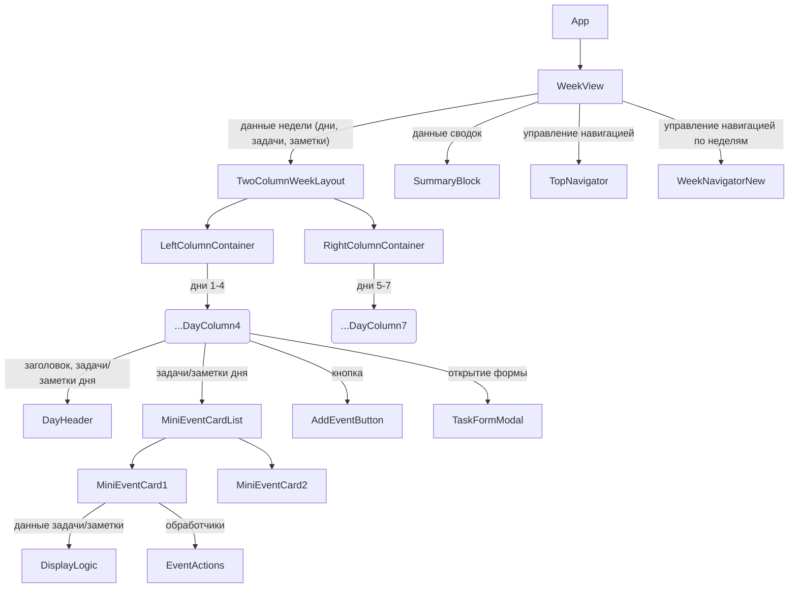

# Анализ влияния нового UI-макета на архитектуру приложения Zyaka Calendar (Отображение недели)

**Дата анализа:** 01.06.2025

**Задача:** Проанализировать, как новый дизайн отображения недели (две колонки с независимой прокруткой и мини-карточками) повлияет на архитектуру фронтенд-приложения.

## 1. Обзор текущей архитектуры и предполагаемые изменения

### Текущая структура отображения недели:
*   **[`WeekView.tsx`](front/src/components/WeekView.tsx:1):** Контейнер верхнего уровня, управляет загрузкой данных (задачи, заметки, сводки) для текущей недели и навигацией между неделями.
*   **[`WeekDaysScroller.tsx`](front/src/components/WeekDaysScroller.tsx:1):** Отвечает за горизонтальную прокрутку/переключение между двумя половинами недели.
*   **[`FirstHalfOfWeek.tsx`](front/src/components/FirstHalfOfWeek.tsx:1) / [`SecondHalfOfWeek.tsx`](front/src/components/SecondHalfOfWeek.tsx:1):** Отображают группы дней (Пн-Ср и Чт-Вс соответственно).
*   **[`DayColumn.tsx`](front/src/components/DayColumn.tsx:1):** Отображает один день с его задачами. Содержит заголовок дня и список задач.
*   **[`TaskItem.tsx`](front/src/components/TaskItem.tsx:1):** Отображает отдельную задачу/расход.
*   **[`NoteField.tsx`](front/src/components/NoteField.tsx:1):** Используется в [`FirstHalfOfWeek.tsx`](front/src/components/FirstHalfOfWeek.tsx:1) для заметок, привязанных, по-видимому, к началу недели.

### Ключевые изменения, требуемые новым дизайном:
*   **Объединение отображения:** Вместо двух переключаемых половин недели – две постоянно видимые вертикальные колонки с независимой прокруткой.
*   **Редизайн элемента задачи/расхода:** Переход от текущего [`TaskItem.tsx`](front/src/components/TaskItem.tsx:1) к "мини-карточкам" с более подробной информацией и новым стилем.
*   **Редизайн колонки дня:** Обновление заголовка дня, стилизация кнопки "Добавить дело".
*   **Навигация:** Изменение расположения и, возможно, вида навигатора по неделям.

## 2. Анализ влияния на компоненты и предложение новой структуры

*   **[`WeekView.tsx`](front/src/components/WeekView.tsx:1):**
    *   **Сохранится:** Логика загрузки данных (`tasksForWeek`, `allNotes`, `notesForCurrentWeek`, `dailySummary`, `monthlySummary`), управление `currentDate`, навигация (`goToPreviousWeek`, `goToNextWeek`), обработка `onDataChange`.
    *   **Изменится/Удалится:**
        *   Состояние `isFirstHalfVisible` и функции `showFirstHalf`, `showSecondHalf` будут удалены.
        *   Разделение дней на `firstHalfDays` и `secondHalfDays` будет пересмотрено для нового двухколоночного макета.
        *   Компонент [`WeekDaysScroller.tsx`](front/src/components/WeekDaysScroller.tsx:1) будет заменен новым компонентом для двухколоночного отображения.
    *   **Новое:**
        *   Будет передавать все 7 дней недели (`weekDays`) и соответствующие данные в новый компонент-контейнер для двух колонок.

*   **[`WeekDaysScroller.tsx`](front/src/components/WeekDaysScroller.tsx:1), [`FirstHalfOfWeek.tsx`](front/src/components/FirstHalfOfWeek.tsx:1), [`SecondHalfOfWeek.tsx`](front/src/components/SecondHalfOfWeek.tsx:1):**
    *   Эти компоненты, скорее всего, **станут не нужны** в их текущем виде.

*   **Новый компонент: `TwoColumnWeekLayout.tsx` (предлагаемое имя)**
    *   **Назначение:** Отображение двух вертикальных колонок с днями недели и независимой прокруткой.
    *   **Props:** `weekDays: Moment[]`, `tasksForWeek: Task[]`, `notesForWeek: Note[]`, `today: Moment`, `onDataChange: () => void`.
    *   **Логика:**
        *   Разделяет `weekDays` на две группы (например, Пн-Чт и Пт-Вс).
        *   Рендерит два `div` элемента (колонки) с независимой прокруткой.
        *   В каждой колонке итерируется по дням и рендерит [`DayColumn.tsx`](front/src/components/DayColumn.tsx:1).
        *   Обрабатывает адаптивность (колонки одна под другой на мобильных).

*   **[`DayColumn.tsx`](front/src/components/DayColumn.tsx:1):**
    *   **Сохранится:** Основная структура и логика.
    *   **Изменится:**
        *   **Заголовок дня:** Обновление структуры и стилей.
        *   **Список задач/расходов:** Замена [`TaskItem.tsx`](front/src/components/TaskItem.tsx:1) на `MiniEventCard.tsx`. Отображение заметок.
        *   **Кнопка "+ Добавить дело":** Обновление стилей и позиции.
    *   **Props:** Возможно, `notesForDay: Note[]`.

*   **[`TaskItem.tsx`](front/src/components/TaskItem.tsx:1):**
    *   Будет **заменен** новым компонентом `MiniEventCard.tsx`.

*   **Новый компонент: `MiniEventCard.tsx` (предлагаемое имя)**
    *   **Назначение:** Отображение мини-карточки для задачи, расхода или заметки.
    *   **Props:** `event: Task | Note`, `onEdit`, `onDelete`, `onDuplicate`.
    *   **Логика и структура (согласно UI-макету):**
        *   Общий стиль карточки.
        *   Раздельное отображение для Задачи, Расхода, Заметки (иконки, поля, цветовое кодирование).
        *   Логика сокращения/полного отображения текста.
        *   Обработка состояний hover, active/selected.
        *   Сохранение drag-and-drop.
        *   Обработка кликов.

*   **[`WeekNavigator.tsx`](front/src/components/WeekNavigator.tsx:1):**
    *   **Изменится:** Удаление кнопок переключения половин недели. Обновление стилей и расположения навигации по неделям.

*   **[`NoteField.tsx`](front/src/components/NoteField.tsx:1):**
    *   Текущее использование не соответствует новому дизайну. Заметки на день будут отображаться через `MiniEventCard.tsx`.

### Диаграмма структуры компонентов (упрощенная):

## 3. Оценка производительности

*   **Загрузка данных:** Не изменится, остается эффективной.
*   **Рендеринг:** Ожидаемое количество элементов (~50 на неделю) не должно вызвать проблем.
    *   **Оптимизации (при необходимости в будущем):** Мемоизация (`React.memo`), виртуализация списков (пока избыточно), ленивая загрузка.
*   **Текущий вывод:** Специальных мер по оптимизации, кроме стандартных практик, не требуется.

## 4. Влияние на API и Бэкенд

*   **API:** Текущие эндпоинты и структура данных **полностью подходят**.
*   **Бэкенд:** Никаких изменений **не требуется**.

## 5. Предложения по реализации

*   **Итеративный подход:**
    1.  Создать `MiniEventCard.tsx`.
    2.  Модифицировать `DayColumn.tsx`.
    3.  Создать `TwoColumnWeekLayout.tsx`.
    4.  Обновить `WeekView.tsx`.
    5.  Обновить `WeekNavigator.tsx`.
    6.  Стилизация и адаптивность.
*   **Управление состоянием:** Текущая схема подходит и не требует изменений.

## Заключение по анализу
Новый UI потребует значительных изменений в структуре фронтенд-компонентов отображения, но эти изменения локализованы и не затрагивают логику данных, API или бэкенд. Текущая архитектура данных хорошо подходит. Производительность не должна стать проблемой.