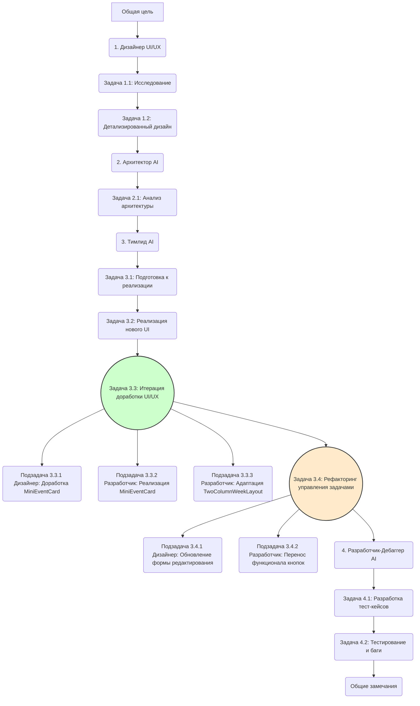

Отлично, команда! У нас амбициозная задача от владельца продукта – улучшить отображение недельного календаря, сделав его более информативным и удобным. Клиент хочет видеть всю неделю целиком, и хотя он готов к зуму, наша цель – превзойти ожидания и создать действительно интуитивное решение. Мы работаем в новой ветке, так что можем смело экспериментировать.

Вот декомпозиция задач для нашей AI-команды с учетом специфики каждого участника:

Общая цель: Переработать текущее отображение недель календаря Zyaka Calendar, объединив две половины недели (Пн-Ср/Чт и Чт/Пт-Вс, в зависимости от настроек начала недели) в один экран, сохранив при этом читаемость задач и общую удобство использования. Верхняя сводка остается без изменений.

1. Для Дизайнера (UI/UX):

Задача 1.1: Исследование и концептуализация нового отображения недели.

Описание: Проанализировать текущий дизайн, обратную связь клиента и предложенный им набросок. Изучить лучшие практики отображения недельных календарей, где требуется уместить значительное количество информации (например, Google Calendar, Outlook Calendar, другие таск-менеджеры). Обратить внимание на способы отображения задач для сохранения читаемости при увеличении плотности информации.
Вдохновение: Рассмотреть, как решаются подобные задачи в других продуктах. Например, setproduct.com обсуждает состояния элементов дня и важность правильного представления дат. Также, идеи по улучшению интуитивности навигации, как в предложенном редизайне Google Calendar (dribbble.com), могут быть полезны для кнопок навигации по неделям.
Цель Задачи: Сформировать 2-3 концепции нового UI для недельного отображения, которые решают проблему объединения двух половин недели на одном экране с акцентом на читаемость и удобство.
Критерии Приемки:
Представлены 2-3 визуальные концепции (скетчи, wireframes или low-fi макеты).
Для каждой концепции кратко описаны плюсы и минусы с точки зрения пользователя.
Учтена необходимость сохранения верхней сводки "как есть".
Предложены варианты отображения задач внутри дня для обеспечения читаемости.

Задача 1.2: Детализированный дизайн и прототипирование выбранной концепции.

Описание: На основе обратной связи по концепциям, разработать детализированный UI-макет (high-fidelity) выбранного варианта. Продумать все состояния элементов (активные дни, сегодняшний день, выбранный день, отображение задач, возможное сокращение названий задач с full view по клику/наведению). Создать интерактивный прототип для демонстрации взаимодействия.
Контекст: Учесть, что пользователь может нуждаться в масштабировании. Дизайн должен быть удобен как в "обзорном" режиме, так и при увеличении для чтения деталей конкретной задачи.
Взаимодействие: Как будут работать кнопки "Добавить дело"? Как будет осуществляться навигация "< Неделя" и "Неделя >" в новом интерфейсе?
Цель Задачи: Создать готовый к разработке UI-макет и интерактивный прототип нового недельного вида.
Критерии Приемки:
Представлены high-fidelity макеты в Figma (или другом инструменте) со всеми состояниями элементов.
Создан интерактивный прототип, демонстрирующий основные сценарии: просмотр недели, добавление дела, навигация по неделям.
Подготовлены UI-кит/спецификации для разработчика (шрифты, цвета, отступы, размеры).
Продумана адаптивность (если применимо, или указаны ограничения).

2. Для Архитектора (AI):

Задача 2.1: Анализ влияния нового дизайна на архитектуру приложения.
Описание: Изучить утвержденный дизайнером UI-макет (результат Задач 1.1 и 1.2). Оценить, потребуются ли изменения в текущей архитектуре фронтенда (структура компонентов, управление состоянием) для реализации нового отображения. Проанализировать, не повлечет ли одновременное отображение всей недели значительного увеличения нагрузки или времени отклика (например, если данные для каждой половины недели подгружались отдельно).
Цель Задачи: Определить необходимые архитектурные изменения или подтвердить, что текущая архитектура справится с новым UI.
Критерии Приемки:
Представлен документ или схема с описанием потенциальных изменений в архитектуре компонентов.
Дана оценка производительности и, при необходимости, предложены пути оптимизации (например, ленивая загрузка задач, если их очень много).
Подтверждено, что изменения не затронут API и бэкенд (или указано, какие изменения могут потребоваться, хотя по условию это маловероятно).

3. Для Тимлида (AI) (для последующей декомпозиции Разработчику):

Задача 3.1: Подготовка к реализации нового недельного отображения.

Описание: На основе утвержденного дизайна (Задачи 1.1, 1.2) и зафиксированных заключений архитектора (Задача 2.1), подготовить техническое задание для разработчика. Определить последовательность реализации компонентов, возможные точки интеграции и зависимости.
Цель Задачи: Создать четкий план разработки нового UI.
Критерии Приемки:
Список подзадач для разработчика (например, создание нового контейнера для недели, обновление компонента дня, обновление компонента задачи, реализация новой логики навигации по неделям, удаление старых кнопок переключения половин недели).
Определены основные компоненты, которые нужно создать или модифицировать.

Задача 3.2 (Передается Разработчику): Реализация нового UI недельного отображения.

Описание: Разработать новый интерфейс отображения недели согласно макетам дизайнера и техническому заданию от тимлида. Обеспечить корректное отображение данных, функциональность кнопок "Добавить дело" и навигации по неделям.
Контекст: Важно обратить внимание на читаемость задач. Возможно, потребуется реализовать механики сокращения длинных названий с возможностью просмотра полного текста по наведению или клику (если это предусмотрено дизайном). Отображение деталей задачи (wingtask.com) может дать общее представление о том, как важна четкость представления информации о задаче.
Цель Задачи: Работоспособный новый интерфейс недельного календаря в приложении, соответствующий дизайну.
Критерии Приемки:
Интерфейс соответствует утвержденным макетам дизайнера pixel-perfect (или с допустимыми отклонениями).
Вся функциональность (просмотр задач, добавление дела, навигация по неделям) работает корректно.
Старая логика переключения половин недели удалена.
Код чистый, хорошо прокомментирован и соответствует стайлгайдам команды.
Компоненты переиспользуемы, где это возможно.

Задача 3.3: Итерация доработки UI/UX по обратной связи и новым требованиям.
Описание: На данном этапе были проведены итеративные доработки на основе обратной связи и уточненных требований, касающихся отображения информации в карточках дохода и адаптивности макета.

Подзадача 3.3.1 (Дизайнер): Доработка дизайна MiniEventCard для карточек дохода.
Описание: Проведена доработка дизайна компонента `MiniEventCard` для корректного отображения информации в карточках дохода, включая полное имя ребенка, время и сумму.
Результат: Представлены обновленные спецификации для `MiniEventCard`:
    - Изменения в CSS для `.card-title`.
    - Добавление классов `.income-card-style`, `.income-meta`.
    - Изменения в JSX для структуры карточки дохода.

Подзадача 3.3.2 (Разработчик): Реализация доработок MiniEventCard.
Описание: Внесены изменения в компоненты и сервисы согласно обновленным спецификациям от дизайнера (Подзадача 3.3.1) для корректного отображения информации о доходах.
Результат:
    - Обновлен [`MiniEventCard.tsx`](front/src/components/MiniEventCard.tsx:1) и [`MiniEventCard.css`](front/src/components/MiniEventCard.css:1).
    - Обновлен тип `EventItem` и `Task` в [`api.ts`](front/src/services/api.ts:1) для поля `child_name`.

Подзадача 3.3.3 (Разработчик): Адаптация TwoColumnWeekLayout для мобильных устройств.
Описание: Проведена адаптация двухколоночного макета для корректного отображения на мобильных устройствах.
Результат:
    - Изменены стили в [`TwoColumnWeekLayout.css`](front/src/components/TwoColumnWeekLayout.css:1).
    - Внесены сопутствующие изменения в [`MiniEventCard.css`](front/src/components/MiniEventCard.css:1) и [`DayColumn.css`](front/src/components/DayColumn.css:1).

Задача 3.4: Рефакторинг управления задачами: перенос кнопок удаления и дублирования.
Приоритет: Важнейший.
Описание: Необходимо убрать кнопки удаления и дублирования дела из карточек событий в недельном виде (компонент `MiniEventCard`) и перенести эту функциональность в карточку/форму редактирования дела. Это изменение соответствует предоставленному макету.

Подзадача 3.4.1 (Дизайнер): Обновление дизайна формы редактирования дела.
Описание: (Если необходимо) Обновить UI-макеты формы редактирования дела (предположительно, компонент, связанный с [`TaskForm.tsx`](front/src/components/TaskForm.tsx:1)), чтобы интегрировать элементы управления для удаления и дублирования задачи.
Результат: Обновленные UI-макеты/спецификации для формы редактирования.

Подзадача 3.4.2 (Разработчик): Перенос функционала кнопок.
Описание: Реализовать перенос функциональности.
Результат:
    - Кнопки "Удалить" и "Дублировать" удалены из компонента `MiniEventCard` и его отображения в недельном виде.
    - Функциональность удаления и дублирования задачи реализована и корректно работает в форме редактирования дела.
    - Код соответствует стайлгайдам, изменения протестированы.

4. Для Разработчика-Дебаггера (AI):

Задача 4.1: Разработка тест-кейсов для нового недельного отображения.

Описание: На основе утвержденного дизайна и технического задания, подготовить исчерпывающий список тест-кейсов. Учесть все возможные сценарии использования: отображение недели с разным количеством задач, задачи разной длины, пустые дни, добавление/удаление задач, навигация, проверка читаемости, корректная работа на границах месяцев/года, взаимодействие с существующей сводкой.
Цель Задачи: Создать набор тест-кейсов для полного покрытия функционала нового UI.
Критерии Приемки:
Представлен документ с тест-кейсами, покрывающими позитивные и негативные сценарии.
Тест-кейсы проверяют как функциональность, так и соответствие UI дизайну.
Учтены аспекты читаемости и юзабилити.

Задача 4.2: Тестирование и документирование багов нового недельного отображения.

Описание: После завершения разработки (Задача 3.2), провести полное тестирование нового интерфейса согласно разработанным тест-кейсам (Задача 4.1). Обнаруженные баги подробно описать и передать разработчику для исправления. Провести регрессионное тестирование после исправлений.
Цель Задачи: Обеспечить высокое качество реализованного функционала, выявить и задокументировать все дефекты.
Критерии Приемки:
Проведены все тесты из тест-плана.
Все найденные баги задокументированы в баг-трекере с шагами воспроизведения, ожидаемым и фактическим результатом, скриншотами/видео.
Проведено регрессионное тестирование после исправления багов.
Финальный отчет о тестировании со статусом "Готово к релизу" (или с описанием критичных неисправленных багов, если таковые имеются).

Общие Замечания для Всей Команды:

Коммуникация: Постоянно общаемся, делимся прогрессом и возникающими проблемами. Дизайнер, архитектор и разработчик должны тесно взаимодействовать на всех этапах.

Итеративность: Если в процессе выяснится, что какое-то решение неудобно или технически сложно реализуемо без ущерба качеству, мы готовы вернуться на шаг назад и пересмотреть его.

Качество в приоритете: Наша задача – не просто выполнить требование клиента, а сделать продукт лучше. Идея с простым зумом – это минимум, мы стремимся к максимуму удобства.

Коллеги, план амбициозный, но вполне реализуемый нашей профессиональной командой. Давайте сделаем Zyaka Calendar еще лучше! Жду ваших вопросов и предложений.