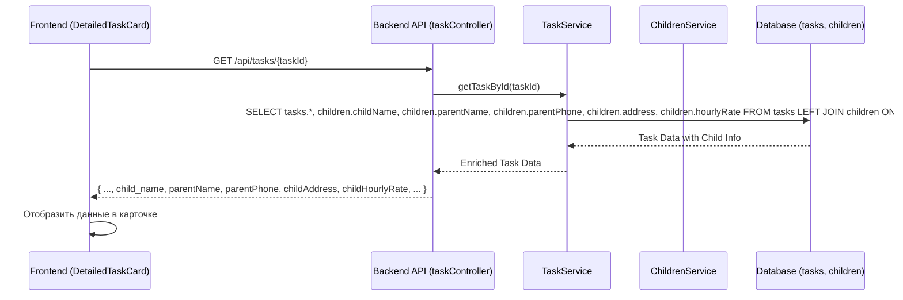

# План по обеспечению доступа к данным ребенка в DetailedTaskCard

**Задача:** Анализ и проектирование доступа к данным ребенка для [`detailed-task-card`](front/src/components/DetailedTaskCard.tsx).

**Контекст родительской задачи:** Необходимо обогатить компонент [`detailed-task-card`](front/src/components/DetailedTaskCard.tsx) дополнительной информацией о ребенке (имя родителя, номер телефона, адрес, ставка в час), к которому относится задача.

## 1. Цель:
Модифицировать сервис задач на бэкенде ([`back/services/taskService.js`](back/services/taskService.js)) для включения полной информации о ребенке (имя родителя, телефон родителя, адрес ребенка, ставка ребенка в час) в объект задачи.

## 2. Шаги:

*   **Обновить запросы к базе данных в `taskService.js`:**
    *   В файле [`back/services/taskService.js`](back/services/taskService.js) необходимо изменить функции, которые получают данные о задачах. В первую очередь это:
        *   `getAllTasks`
        *   `getTaskById`
        *   `getTasksByDate`
    *   В этих функциях, в запросах Knex, нужно добавить выборку следующих полей из таблицы `children` (которая уже присоединяется через `LEFT JOIN`):
        *   `children.parentName AS parentName`
        *   `children.parentPhone AS parentPhone`
        *   `children.address AS childAddress`
        *   `children.hourlyRate AS childHourlyRate`
    *   **Пример изменения для `getTaskById`:**
        ```javascript
        // Было:
        // .select(
        //     'tasks.*',
        //     'children.childName as childName', // или child_name в зависимости от других функций
        //     'expense_categories.category_name as expenseCategoryName'
        // )
        // .leftJoin('children', 'tasks.childId', 'children.uuid')

        // Станет:
        .select(
            'tasks.*',
            'children.childName as child_name', // Убедиться, что алиас соответствует ожиданиям (child_name или childName)
            'children.parentName as parentName',
            'children.parentPhone as parentPhone',
            'children.address as childAddress',
            'children.hourlyRate as childHourlyRate',
            'expense_categories.category_name as expenseCategoryName'
        )
        .leftJoin('children', 'tasks.childId', 'children.uuid')
        ```
    *   Необходимо обеспечить консистентность алиасов (например, `child_name` используется в `getTasksByDate`, в то время как `DetailedTaskCard` ожидает `child_name`. Для остальных полей ребенка (`parentName`, `parentPhone`, `childAddress`, `childHourlyRate`) компонент ожидает именно такие имена).

*   **(Опционально, но рекомендуется) Обновить тип `Task` на фронтенде:**
    *   Если тип `Task` определен централизованно в [`front/src/services/api.ts`](front/src/services/api.ts), его нужно обновить, добавив новые поля: `parentName?: string;`, `parentPhone?: string;`, `childAddress?: string;`, `childHourlyRate?: number;`.
    *   В компоненте [`front/src/components/DetailedTaskCard.tsx`](front/src/components/DetailedTaskCard.tsx) уже есть комментарий, указывающий на необходимость этих полей в типе `Task`. Если тип `Task` импортируется, то изменения нужно будет внести в исходный файл типа.

*   **Проверка контроллера `taskController.js`:**
    *   Убедиться, что [`back/controllers/taskController.js`](back/controllers/taskController.js) не модифицирует и не отфильтровывает эти новые поля при передаче данных от сервиса клиенту. Обычно контроллеры просто передают результат вызова сервиса, так что изменения здесь, скорее всего, не потребуются.

## 3. Визуализация (Mermaid):



## 4. Ожидаемый результат после внедрения:
*   Компонент [`front/src/components/DetailedTaskCard.tsx`](front/src/components/DetailedTaskCard.tsx) будет получать все необходимые данные о ребенке (имя ребенка, имя родителя, телефон родителя, адрес ребенка, ставка ребенка в час) в пропсе `task` и корректно их отображать.
*   Дополнительные запросы с фронтенда для получения этих данных не потребуются.