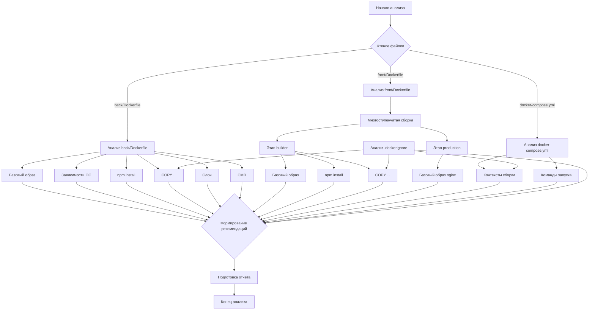

# Отчет по анализу Docker-конфигураций и рекомендации по оптимизации EvaCalendar

Дата анализа: 04.06.2025

## 0. План анализа (согласованный)

1.  **Детальный анализ [`back/Dockerfile`](back/Dockerfile:1):**
    *   Базовый образ, установка зависимостей ОС, установка npm-пакетов, копирование файлов, слои, CMD.
2.  **Детальный анализ [`front/Dockerfile`](front/Dockerfile:1):**
    *   Многоступенчатая сборка, этапы `builder` и `production`, базовые образы, npm-пакеты, копирование артефактов.
3.  **Анализ [`docker-compose.yml`](docker-compose.yml:1):**
    *   Контексты сборки, команды запуска, передача аргументов.
4.  **Общие рекомендации и `.dockerignore`:**
    *   Проверка и дополнение файлов `.dockerignore` для `back` и `front`.
    *   Минимизация количества слоев.
5.  **Формирование отчета:**
    *   Структурированный отчет с конкретными предложениями и обоснованиями.

**Визуализация процесса анализа (Mermaid):**



## 1. Анализ `back/Dockerfile` ([`back/Dockerfile`](back/Dockerfile:1))

*   **Текущее состояние:**
    *   Базовый образ: `node:20-alpine`.
    *   Устанавливаются системные зависимости: `python3`, `make`, `g++`, `ca-certificates` (предположительно для `sqlite3`).
    *   Обновляются сертификаты.
    *   Устанавливаются npm-зависимости: `npm install`.
    *   Копируется все содержимое текущей директории: `COPY . .`.
    *   Используется `VOLUME /app/data` для данных SQLite.
    *   Команда запуска: `CMD ["npm", "start"]`.
    *   Файл [`back/.dockerignore`](back/.dockerignore:1) существует и содержит: `node_modules`, `npm-debug.log`, `.git`, `.gitignore`, `Dockerfile`.

*   **Рекомендации по оптимизации:**
    1.  **Многоступенчатая сборка (Multistage build):**
        *   **Проблема:** Зависимости `python3`, `make`, `g++` необходимы для сборки нативных модулей, но не нужны для выполнения приложения, увеличивая размер образа.
        *   **Решение:** Использовать многоступенчатую сборку.
            *   **Этап `builder`:** На базе `node:20-alpine` установить сборочные зависимости, скопировать `package*.json`, выполнить `npm install`.
            *   **Этап `runner`:** На базе `node:20-alpine` скопировать `node_modules` и исходный код приложения из этапа `builder`.
        *   **Обоснование:** Значительно уменьшит размер финального образа.
    2.  **Оптимизация установки зависимостей и слоев:**
        *   **Проблема:** Раздельные `RUN` для `apk add` и `update-ca-certificates` создают лишние слои.
        *   **Решение (для этапа `builder` или если не используется multistage):** Объединить команды и добавить очистку кеша `apk`.
            ```dockerfile
            RUN apk update && \
                apk add --no-cache python3 make g++ ca-certificates && \
                update-ca-certificates && \
                rm -rf /var/cache/apk/*
            ```
        *   **Обоснование:** Уменьшение количества слоев и удаление кеша `apk`.
    3.  **Установка npm-пакетов:**
        *   **Проблема:** `npm install` может устанавливать `devDependencies`.
        *   **Решение:** Использовать `npm ci --only=production` и добавить `npm cache clean --force`.
            ```dockerfile
            COPY package*.json ./
            RUN npm ci --only=production && npm cache clean --force
            ```
        *   **Обоснование:** Уменьшает размер `node_modules` и образа.
    4.  **Оптимизация `COPY . .`:**
        *   **Проблема:** Копирование всего контекста может включать ненужные файлы и ухудшает кеширование.
        *   **Решение:** Более гранулярно копировать необходимые файлы и папки.
            ```dockerfile
            # Пример
            COPY package*.json ./
            # ... npm install ...
            COPY db.cjs knexfile.cjs index.js ./
            COPY controllers ./controllers
            # и т.д.
            ```
        *   **Обоснование:** Уменьшает размер образа, улучшает кеширование.
    5.  **Оптимизация `CMD`:**
        *   **Проблема:** `npm start` создает лишний процесс.
        *   **Решение:** Запускать приложение напрямую: `CMD ["node", "index.js"]`.
        *   **Обоснование:** Уменьшает количество процессов.
    6.  **Дополнение к [`back/.dockerignore`](back/.dockerignore:1):**
        *   **Рекомендация:** Добавить `README.md`, `*.test.js`, `jest.config.js`, `.vscode/`, локальные `.env`.
        *   **Обоснование:** Уменьшает контекст сборки.

## 2. Анализ `front/Dockerfile` ([`front/Dockerfile`](front/Dockerfile:1))

*   **Текущее состояние:**
    *   Используется многоступенчатая сборка.
    *   Этап `builder`: `node:20-alpine`, `npm install`, `npm run build`.
    *   Этап `production`: `nginx:alpine`, копируется `nginx.conf` и статика.
    *   Файл [`front/.dockerignore`](front/.dockerignore:1) существует.

*   **Рекомендации по оптимизации:**
    1.  **Установка npm-пакетов на этапе `builder`:**
        *   **Решение:** Использовать `npm ci && npm cache clean --force` (или `npm install && npm cache clean --force`, если `devDependencies` нужны для сборки).
        *   **Обоснование:** `npm ci` для надежности, очистка кеша для уменьшения слоя.
    2.  **Файл [`front/.dockerignore`](front/.dockerignore:1):**
        *   **Рекомендация:** Проверить на специфичные для проекта временные файлы (`*.log`, `.DS_Store`).
        *   **Обоснование:** Поддержание чистоты контекста.
    3.  **Конфигурация Nginx ([`nginx.conf`](front/nginx.conf)):**
        *   **Рекомендация (вне размера образа):** Проверить `nginx.conf` на оптимальные настройки (gzip, кеширование).
        *   **Обоснование:** Улучшение производительности.

## 3. Анализ `docker-compose.yml` ([`docker-compose.yml`](docker-compose.yml:1))

*   **Текущее состояние:**
    *   Определены сервисы `back` и `front`.
    *   Команда для `back`: `sh -c "npm run migrate:latest && npm start"`.

*   **Рекомендации по оптимизации:**
    1.  **Команда запуска для `back`:**
        *   **Решение (удобство):** Вынести миграции в entrypoint-скрипт в образе `back`.
        *   **Обоснование:** Гибкость и чистота `docker-compose.yml`.
        *   **Решение (процессы):** Заменить `npm start` на `node index.js` в команде.
        *   **Обоснование:** Уменьшение количества процессов.

## 4. Общие рекомендации

1.  **Регулярный аудит зависимостей:** Удалять неиспользуемые npm-пакеты.
    *   **Обоснование:** Уменьшает объем кода.
2.  **Использование специфичных версий базовых образов:** Например, `node:20.10.0-alpine`.
    *   **Обоснование:** Предсказуемость сборок.
3.  **Минимизация количества слоев:** Объединять логически связанные команды `RUN`.
    *   **Обоснование:** Меньший размер метаданных образа, потенциально быстрая передача.