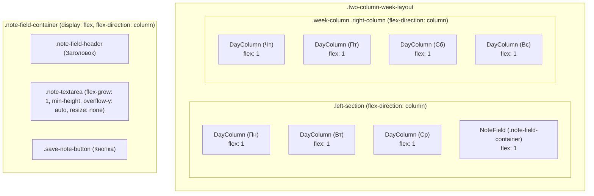

# План по выравниванию высоты блоков "Заметки" и "День без задач"

## 1. Контекст и Цель

**Задача:** Обеспечить одинаковую динамическую высоту для блоков "Заметки" и "День без задач" (пустой `DayColumn`). Высота каждого из этих блоков должна составлять 1/4 от высоты их общего родительского контейнера в соответствующей колонке недели (левой или правой).

**Ключевые требования от дизайнера (адаптированные):**
*   Эталонная высота блока "Заметки" будет такой же, как у блока "День без задач".
*   Стили блока "Заметки" (фон, отступы, скругления, тень) будут соответствовать стилям блока "День без задач".
*   Внутренняя структура блока "Заметки": заголовок "Заметки", поле для ввода текста (`<textarea>`), кнопка "Сохранить". Элементы располагаются вертикально (flexbox).
*   Поведение поля ввода текста:
    *   Мало контента: Поле ввода занимает доступное пространство (с `min-height`). Прокрутка отсутствует.
    *   Много контента: Если текст превышает доступное пространство, ВНУТРИ поля ввода появляется вертикальная полоса прокрутки. Размер поля ввода не изменяется пользователем (`resize: none`).
*   Кнопка "Сохранить" всегда видна внизу блока.

## 2. Анализ текущей ситуации

*   Блоки "Заметки" ([`front/src/components/NoteField.tsx`](../front/src/components/NoteField.tsx)) и "День без задач" (компонент [`front/src/components/DayColumn.tsx`](../front/src/components/DayColumn.tsx), когда пуст) находятся в компоненте [`front/src/components/TwoColumnWeekLayout.tsx`](../front/src/components/TwoColumnWeekLayout.tsx).
*   В левой колонке (`.left-section`) отображаются три `DayColumn` и `NoteField`. В правой колонке (`.right-column`) — четыре `DayColumn`.
*   Текущая высота `DayColumn` (когда он пуст) и `NoteField` не синхронизирована и не распределяется равномерно. `NoteField` использует класс `.day-column`, что может приводить к конфликтам стилей. `textarea` в `NoteField` имеет `resize: vertical`.

## 3. Предлагаемое решение (CSS Flexbox)

Решение будет основано на CSS Flexbox для достижения динамического и равномерного распределения высоты. JavaScript не потребуется.

### 3.1. Реструктуризация DOM в `TwoColumnWeekLayout.tsx`

**Файл:** [`front/src/components/TwoColumnWeekLayout.tsx`](../front/src/components/TwoColumnWeekLayout.tsx)

1.  **Изменить структуру `.left-section`**:
    *   Удалить существующую обертку `.days-column` для первых трех дней недели.
    *   Компоненты `DayColumn` для Понедельника, Вторника, Среды и компонент `NoteField` должны стать **прямыми дочерними элементами** контейнера `.left-section`.
    *   Каждому из этих четырех прямых дочерних элементов будет неявно или явно присвоено свойство `flex: 1` (или его эквивалент через CSS), чтобы они равномерно делили высоту `.left-section`.

    Примерная структура для `.left-section`:
    ```html
    <div className="left-section">
      <DayColumn ... /> {/* Понедельник */}
      <DayColumn ... /> {/* Вторник */}
      <DayColumn ... /> {/* Среда */}
      <NoteField ... /> {/* Заметки */}
    </div>
    ```
2.  **Структура `.right-column`**: Остается без изменений, так как `DayColumn` уже являются прямыми потомками и должны равномерно делить высоту благодаря `flex: 1` (или `height: 100%` в flex-контексте).

### 3.2. Стилизация `NoteField`

1.  **Создать новый CSS-файл:** [`front/src/components/NoteField.css`](../front/src/components/NoteField.css)
2.  **Импортировать `NoteField.css`** в [`front/src/components/NoteField.tsx`](../front/src/components/NoteField.tsx).
3.  **Обновить `NoteField.tsx`**:
    *   Изменить корневой `div` компонента `NoteField`, чтобы он использовал новый уникальный класс, например, `.note-field-container` вместо `.day-column`.
    *   Добавить классы для внутренних элементов: `.note-field-header`, `.note-textarea`, `.save-note-button`.

4.  **Определить стили в `NoteField.css`**:

    *   **`.note-field-container`**:
        *   `flex: 1;` (чтобы занять свою долю высоты от родительского `.left-section`).
        *   `display: flex;`
        *   `flex-direction: column;` (для вертикального расположения внутренних элементов).
        *   `padding`, `background-color`, `border-radius`, `box-shadow`: аналогично стилям `.day-column` из [`front/src/components/DayColumn.css`](../front/src/components/DayColumn.css) для визуального единообразия.
        *   `overflow: hidden;` (чтобы внутренний скролл `textarea` не влиял на внешний вид).

    *   **`.note-field-header`** (для заголовка "Заметки"):
        *   Стилизовать аналогично `.day-header` из `DayColumn.css` (шрифт, отступы).

    *   **`.note-textarea`**:
        *   `flex-grow: 1;` (чтобы занимать все доступное вертикальное пространство между заголовком и кнопкой).
        *   `min-height: 50px;` (или другое подходящее значение, чтобы блок не схлопывался, когда текста нет).
        *   `width: 100%;`
        *   `padding: 8px;`
        *   `margin-top: 10px;` (или по дизайну).
        *   `border: 1px solid var(--color-border-medium);`
        *   `border-radius: 4px;`
        *   `background-color: var(--color-input-background);` (или `var(--color-background-soft)`).
        *   `color: var(--color-text-primary);`
        *   `resize: none;` (согласно ТЗ).
        *   `overflow-y: auto;` (для появления внутренней полосы прокрутки при переполнении).
        *   `box-sizing: border-box;`

    *   **`.save-note-button`** (для кнопки "Сохранить"):
        *   Стилизовать аналогично `.add-event-button` из `DayColumn.css` для единообразия, но с возможностью кастомизации.
        *   Убедиться, что кнопка всегда видна внизу блока (Flexbox на `.note-field-container` должен это обеспечить).
        *   `margin-top: 10px;` (или по дизайну).

### 3.3. Корректировка существующих CSS

1.  **[`front/src/components/DayColumn.css`](../front/src/components/DayColumn.css)**:
    *   Убедиться, что класс `.day-column` имеет `flex: 1;` или эквивалентное свойство (`height: 100%;` в контексте родителя-flex контейнера уже присутствует и должно работать корректно), чтобы он занимал выделенное ему пространство в `.left-section` или `.right-column`.
    *   Убедиться, что `display: flex;` и `flex-direction: column;` присутствуют для `.day-column` для правильной внутренней компоновки.

2.  **[`front/src/components/TwoColumnWeekLayout.css`](../front/src/components/TwoColumnWeekLayout.css)**:
    *   Контейнеры `.left-section` и `.week-column` уже имеют `display: flex; flex-direction: column;`. Это правильно.
    *   Проверить, что нет конфликтующих стилей (например, фиксированных высот или `flex-basis` у дочерних элементов, которые должны делить пространство), которые могли бы помешать равномерному распределению высоты.

3.  **[`front/src/index.css`](../front/src/index.css)**:
    *   Удалить или закомментировать стили для `.note-textarea` ([`front/src/index.css:515-525`](../front/src/index.css:515-525)), так как они будут перенесены в `NoteField.css`.

## 4. Визуализация структуры (Mermaid)



## 5. Влияние на производительность

*   Решение полностью основано на CSS (Flexbox), что является наиболее производительным подходом для задач компоновки.
*   JavaScript для синхронизации высоты не потребуется, что исключает потенциальные проблемы с производительностью, связанные с манипуляциями DOM или расчетами в JS.

## 6. Ожидаемый результат

*   Блоки `DayColumn` (включая пустые "Дни без задач") и `NoteField` будут иметь одинаковую высоту, динамически адаптирующуюся к высоте родительских колонок (`.left-section`, `.week-column`).
*   В левой колонке каждый из четырех блоков (3 дня + заметки) будет занимать 1/4 высоты колонки.
*   В правой колонке каждый из четырех блоков дней будет занимать 1/4 высоты колонки.
*   Блок "Заметки" будет стилизован в соответствии с блоком "День без задач".
*   Поле `textarea` в "Заметках" будет иметь внутреннюю прокрутку при переполнении и не будет изменять свой размер пользователем.

## 7. Дальнейшие шаги

*   Реализация изменений в коде согласно плану.
*   Тщательное тестирование на различных разрешениях экрана и с разным объемом контента в `textarea`.