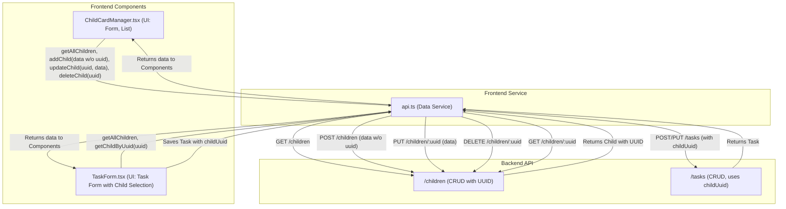

# План рефакторинга фронтенда: Переход на `uuid` для "детей"

## Общая стратегия:

1.  **Изменение интерфейсов**: Обновить TypeScript интерфейсы (`Child`, `Task`) для использования `uuid`.
2.  **Обновление сервиса API**: Модифицировать функции в `front/src/services/api.ts` для работы с `uuid`.
3.  **Обновление компонентов**: Внести изменения в компоненты (`ChildCardManager.tsx`, `TaskForm.tsx` и др., если будут выявлены) для корректной работы с `uuid`.
4.  **Источник `uuid` при создании**: Бэкенд будет отвечать за генерацию `uuid` при создании новой записи о ребенке. Фронтенд не должен генерировать `uuid` для новых детей.

## Диаграмма взаимодействия (упрощенная):



## Детальные изменения по файлам:

### 1. `front/src/services/api.ts`

*   **Интерфейс `Child`**:
    *   Переименовать поле `id: string;` на `uuid: string;`.
    *   _Пример после изменения:_
        ```typescript
        export interface Child {
          uuid: string; // Было id
          childName: string;
          parentName: string;
          parentPhone: string | null;
          address: string | null;
          hourlyRate: number | null;
          comment: string | null;
        }
        ```

*   **Интерфейс `Task`**:
    *   Переименовать поле `childId?: string;` на `childUuid?: string;` для ясности, что это UUID ребенка.
    *   _Пример после изменения:_
        ```typescript
        export interface Task {
          uuid: string | undefined;
          title: string;
          type: string;
          // ... другие поля
          childUuid?: string; // Было childId
          // ... другие поля
        }
        ```

*   **Функция `getAllChildren`**:
    *   Изменений в логике не требуется, но возвращаемый тип `Child[]` теперь будет содержать `uuid`.

*   **Функция `getChildById`**:
    *   Переименовать функцию на `getChildByUuid`.
    *   Изменить параметр `id: string` на `uuid: string`.
    *   Обновить URL запроса на `/children/${uuid}`.
    *   _Пример после изменения:_
        ```typescript
        export const getChildByUuid = async (uuid: string) => { // Было getChildById(id: string)
            const response = await api.get(`/children/${uuid}`); // Было /children/${id}
            return response.data as Child;
        };
        ```

*   **Функция `addChild`**:
    *   Изменить тип параметра `child: Omit<Child, 'id'>` на `child: Omit<Child, 'uuid'>`. Это означает, что объект `child`, передаваемый для создания, не должен содержать поле `uuid`, так как его сгенерирует бэкенд.
    *   _Пример после изменения:_
        ```typescript
        export const addChild = async (child: Omit<Child, 'uuid'>) => { // Было Omit<Child, 'id'>
            const response = await api.post('/children', child);
            return response.data as Child; // Бэкенд вернет Child с сгенерированным uuid
        };
        ```

*   **Функция `updateChild`**:
    *   Изменить первый параметр `id: string` на `uuid: string`.
    *   Внутри функции, при деструктуризации `child` для исключения идентификатора из тела запроса, использовать `uuid` вместо `id`.
        *   `const { uuid: childUuidToExclude, ...childDataToSend } = child;`
    *   Обновить URL запроса на `/children/${uuid}`.
    *   _Пример после изменения:_
        ```typescript
        export const updateChild = async (uuid: string, child: Child) => { // Было id: string
            // Деструктурируем объект child, чтобы исключить поле 'uuid' из тела запроса
            const { uuid: childUuidToExclude, ...childDataToSend } = child; // Было id: childIdToExclude
            const response = await api.put(`/children/${uuid}`, childDataToSend); // Было /children/${id}
            return response.data as Child;
        };
        ```

*   **Функция `deleteChild`**:
    *   Изменить параметр `id: string` на `uuid: string`.
    *   Обновить URL запроса на `/children/${uuid}`.
    *   _Пример после изменения:_
        ```typescript
        export const deleteChild = async (uuid: string) => { // Было id: string
            const response = await api.delete(`/children/${uuid}`); // Было /children/${id}
            return response.data;
        };
        ```

### 2. `front/src/components/ChildCardManager.tsx`

*   **Импорты из `../services/api`**:
    *   Заменить `getChildById` на `getChildByUuid` (если используется).
    *   Убедиться, что импортируется обновленный тип `Child`.

*   **Компонент `ChildForm`**:
    *   **Состояние `formData`**:
        *   При инициализации для нового ребенка (когда `initialChild` отсутствует), не генерировать `id: uuidv4()`. Поле `uuid` должно отсутствовать или быть `undefined` для новых записей.
        *   Тип `Child` в `useState<Child>` теперь будет иметь поле `uuid`. Для нового ребенка `uuid` будет `undefined`.
        *   _Пример изменения инициализации (упрощенно):_
            ```typescript
            // было: id: uuidv4(),
            // станет: (initialChild и его uuid) или объект без uuid для нового
            const [formData, setFormData] = useState<Partial<Child>>( // Или Omit<Child, 'uuid'> & { uuid?: string }
              initialChild || {
                // uuid: undefined, // uuid не устанавливается здесь
                childName: '',
                parentName: '',
                // ... остальные поля
              }
            );
            ```

*   **Компонент `ChildCardManager`**:
    *   **Состояние `children`**: `useState<Child[]>` будет использовать обновленный тип `Child` с `uuid`.
    *   **Состояние `editingChild`**: `useState<Child | undefined>` также будет использовать обновленный тип `Child`.
    *   **Функция `handleAddOrUpdateChild`**:
        *   Логика определения "обновление или добавление" должна теперь основываться на наличии `childData.uuid`.
        *   При обновлении (если `childData.uuid` существует): вызывать `await updateChild(childData.uuid, childData);`.
        *   При добавлении новой карточки (если `childData.uuid` отсутствует):
            *   Создать объект `childDataWithoutUuid` путем исключения поля `uuid` из `childData`.
            *   Вызывать `await addChild(childDataWithoutUuid);`.
        *   _Пример изменения:_
            ```typescript
            const handleAddOrUpdateChild = async (childData: Child) => { // childData может иметь uuid или нет
              try {
                if (childData.uuid) { // Если UUID существует, это обновление
                  await updateChild(childData.uuid, childData);
                  toast.success('Карточка ребенка успешно обновлена!');
                } else { // Иначе, это новый ребенок
                  const { uuid, ...dataToSend } = childData; // Исключаем uuid если он там случайно есть
                  await addChild(dataToSend as Omit<Child, 'uuid'>);
                  toast.success('Новая карточка ребенка успешно добавлена!');
                }
                // ... остальная логика
              } // ...
            };
            ```
    *   **Функция `handleDeleteChild`**:
        *   Параметр `id: string` должен стать `uuid: string`.
        *   Вызывать `await deleteChild(uuid);`.
    *   **Отображение списка детей**:
        *   Ключ для элемента списка: `key={child.uuid}` (было `child.id`).
    *   **Кнопка "Редактировать"**:
        *   При вызове `setEditingChild(child)` будет передан объект `child` с полем `uuid`.
    *   **Кнопка "Удалить"**:
        *   Вызывать `handleDeleteChild(child.uuid)` (было `child.id`).

### 3. `front/src/components/TaskForm.tsx`

*   **Импорты из `../services/api`**:
    *   Заменить `getChildById` на `getChildByUuid`.
    *   Убедиться, что импортируются обновленные типы `Child` и `Task`.

*   **Состояние `formData`**:
    *   Поле `childId` переименовать в `childUuid`.
    *   Соответственно обновить все использования `formData.childId` на `formData.childUuid`.

*   **Состояние `children`**: `useState<Child[]>` будет использовать обновленный тип `Child` с `uuid`.

*   **Состояние `selectedChildId`**:
    *   Переименовать в `selectedChildUuid: string | null`.
    *   Обновить все использования `selectedChildId` на `selectedChildUuid`.

*   **`useEffect` для `initialData`**:
    *   Обновить `initialData.childId` на `initialData.childUuid` при установке `selectedChildUuid`.

*   **`useEffect` для загрузки детей и категорий**:
    *   Логику поиска ребенка по `initialData.childName` удалить.
    *   При установке `selectedChildUuid` из `foundChild`, использовать `foundChild.uuid`.

*   **`useEffect` для загрузки данных выбранного ребенка**:
    *   Вызывать `await getChildByUuid(selectedChildUuid as string);`.
    *   При обновлении `formData`, устанавливать `childUuid: childData.uuid`.

*   **Функция `handleChange`**:
    *   При изменении `childSelect`, устанавливать `setSelectedChildUuid`.

*   **Функция `handleSubmit`**:
    *   В `dataToSave`, поле `childId` заменить на `childUuid`.

*   **Отображение формы (в `modalContent`)**:
    *   Выпадающий список "Выбрать ребенка" (`childSelect`):
        *   Значение опции: `value={child.uuid ?? ''}`.
        *   Ключ опции: `key={child.uuid ?? index}`.
    *   Убедиться, что все обращения к `childId` в `formData` или `selectedChildId` заменены на их `uuid` аналоги.

## Дополнительные проверки:

*   После внесения этих изменений, рекомендуется выполнить глобальный поиск по проекту на предмет оставшихся использований `childId` (в контексте идентификатора ребенка) и `getChildById`, чтобы убедиться, что все вхождения заменены.
*   Проверить типы во всех связанных функциях и компонентах на предмет корректного использования `uuid` и `childUuid`.