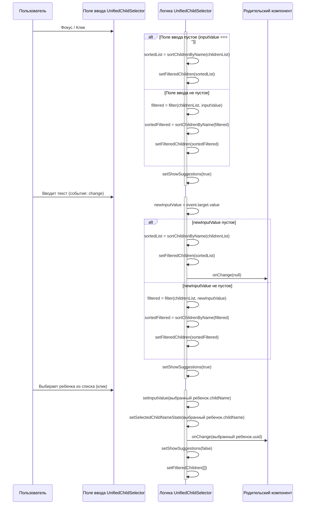

# План по проектированию механизма отображения, фильтрации и сортировки в UnifiedChildSelector

**Дата:** 02.06.2025

**Компонент:** [`front/src/components/UnifiedChildSelector.tsx`](../front/src/components/UnifiedChildSelector.tsx:1)

## 1. Анализ текущего состояния (завершено):

*   Компонент [`UnifiedChildSelector`](../front/src/components/UnifiedChildSelector.tsx:1) получает полный список детей (`childrenList`) через props ([`UnifiedChildSelector.tsx:8`](../front/src/components/UnifiedChildSelector.tsx:8)).
*   Бэкенд ([`back/controllers/childrenController.js`](../back/controllers/childrenController.js:1), [`back/services/childrenService.js`](../back/services/childrenService.js:1)) предоставляет API (`getAllChildren` ([`childrenService.js:19`](../back/services/childrenService.js:19))) для получения полного списка детей.
*   Текущая фильтрация в [`UnifiedChildSelector.tsx`](../front/src/components/UnifiedChildSelector.tsx:1) происходит на клиенте по `childName` (используя `includes` для поиска подстроки, без учета регистра) ([`UnifiedChildSelector.tsx:66-68`](../front/src/components/UnifiedChildSelector.tsx:66-68)).
*   Тип `Child` определен в [`front/src/services/api.ts`](../front/src/services/api.ts:17) и содержит поле `childName`, которое будет использоваться для фильтрации и сортировки.

## 2. Цели проекта:

*   При фокусе или клике на селектор, если поле ввода пустое, немедленно отображать **полный список** детей.
*   Если в поле ввода уже есть текст, при фокусе отображать **отфильтрованный список**, соответствующий этому тексту.
*   При вводе текста пользователем список должен **динамически фильтроваться**.
*   Как полный, так и отфильтрованный списки должны быть **отсортированы по `childName` в алфавитном порядке**.
*   Фильтрация должна осуществляться по полю `childName` по принципу **"содержит"**, **без учета регистра**.

## 3. Предлагаемое техническое решение:

### 3.1. Получение и хранение данных:

*   **Без изменений:** Компонент [`UnifiedChildSelector`](../front/src/components/UnifiedChildSelector.tsx:1) продолжит получать полный список `childrenList` через props.

### 3.2. Логика отображения списка при фокусе/клике:

*   Место реализации: компонент [`UnifiedChildSelector.tsx`](../front/src/components/UnifiedChildSelector.tsx:1).
*   Модифицировать обработчик `onFocus` ([`UnifiedChildSelector.tsx:155`](../front/src/components/UnifiedChildSelector.tsx:155)) для элемента `input`.
*   **Алгоритм для `onFocus`:**
    1.  Проверить, есть ли элементы в `childrenList`. Если нет, ничего не делать.
    2.  Получить текущее значение `inputValue`, привести к нижнему регистру и удалить пробелы по краям.
    3.  Инициализировать `listToShow` полным списком `childrenList`.
    4.  Если `inputValue` не пустое:
        *   Отфильтровать `childrenList` по `childName`, используя принцип "содержит" (без учета регистра) с текущим `inputValue`. Результат присвоить `listToShow`.
    5.  Отсортировать `listToShow` по `childName` в алфавитном порядке (без учета регистра).
    6.  Установить отсортированный `listToShow` в состояние `filteredChildren`.
    7.  Установить состояние `showSuggestions` в `true`.

### 3.3. Логика фильтрации и сортировки при вводе текста:

*   Место реализации: компонент [`UnifiedChildSelector.tsx`](../front/src/components/UnifiedChildSelector.tsx:1).
*   Модифицировать обработчик `handleInputChange` ([`UnifiedChildSelector.tsx:53`](../front/src/components/UnifiedChildSelector.tsx:53)).
*   **Алгоритм для `handleInputChange`:**
    1.  Обновить `inputValue` новым значением из события.
    2.  Сбросить `selectedChildNameState` в `null`.
    3.  Получить `newInputValue`, привести к нижнему регистру и удалить пробелы по краям.
    4.  Инициализировать `listToShow`.
    5.  Если `newInputValue` пусто:
        *   Присвоить `listToShow` полный список `childrenList`.
        *   Вызвать `onChange(null)`, чтобы сбросить выбранного ребенка в родительском компоненте.
    6.  Если `newInputValue` не пусто:
        *   Отфильтровать `childrenList` по `childName` ("содержит", без учета регистра) с `newInputValue`. Результат присвоить `listToShow`.
    7.  Отсортировать `listToShow` по `childName` в алфавитном порядке (без учета регистра).
    8.  Установить отсортированный `listToShow` в состояние `filteredChildren`.
    9.  Установить `showSuggestions` в `true`, если `childrenList` не пуст.

### 3.4. Функция сортировки:

*   Создать вспомогательную функцию внутри или вне компонента [`UnifiedChildSelector.tsx`](../front/src/components/UnifiedChildSelector.tsx:1) для сортировки массива детей по `childName`:
    ```typescript
    const sortChildrenByName = (children: Child[]): Child[] => {
      // Создаем копию массива перед сортировкой, чтобы не мутировать оригинальный prop childrenList
      return [...children].sort((a, b) =>
        a.childName.toLowerCase().localeCompare(b.childName.toLowerCase())
      );
    };
    ```

### 3.5. Место выполнения логики:

*   Вся логика отображения, фильтрации и сортировки будет выполняться **на стороне клиента**, непосредственно в React-компоненте [`UnifiedChildSelector.tsx`](../front/src/components/UnifiedChildSelector.tsx:1).

### 3.6. Соображения по производительности:

*   **Текущий подход:** Для списков детей разумного размера (до нескольких сотен) предложенные операции фильтрации и сортировки на клиенте будут достаточно быстрыми.
*   **Оптимизации (если возникнет необходимость в будущем для очень больших списков):**
    *   **Мемоизация `useMemo`**.
    *   **Виртуализация списка** (например, `react-window` или `react-virtualized`). *На данном этапе это считается преждевременной оптимизацией.*

## 4. Диаграмма последовательности (Mermaid):



## 5. Указания по реализации (ключевые изменения в [`UnifiedChildSelector.tsx`](../front/src/components/UnifiedChildSelector.tsx:1)):

1.  **Добавить функцию `sortChildrenByName`** (как описано в 3.4).
2.  **Обновить обработчик `onFocus`** ([`UnifiedChildSelector.tsx:155`](../front/src/components/UnifiedChildSelector.tsx:155)):
    ```typescript
    onFocus={() => {
      if (childrenList.length > 0) {
        const currentInput = inputValue.trim().toLowerCase();
        let listToShow = childrenList;
        if (currentInput !== '') {
          listToShow = childrenList.filter(child =>
            child.childName.toLowerCase().includes(currentInput)
          );
        }
        setFilteredChildren(sortChildrenByName(listToShow));
        setShowSuggestions(true);
      }
    }}
    ```
3.  **Обновить обработчик `handleInputChange`** ([`UnifiedChildSelector.tsx:53`](../front/src/components/UnifiedChildSelector.tsx:53)):
    ```typescript
    const handleInputChange = (event: React.ChangeEvent<HTMLInputElement>) => {
      const newInputValue = event.target.value;
      setInputValue(newInputValue);
      setSelectedChildNameState(null); // Сбрасываем имя, так как пользователь редактирует

      if (newInputValue.trim() === '') {
        if (childrenList.length > 0) {
          setFilteredChildren(sortChildrenByName(childrenList)); // Показываем всех отсортированных
        } else {
          setFilteredChildren([]);
        }
        setShowSuggestions(childrenList.length > 0);
        onChange(null); // Сбрасываем выбор
        return;
      }

      const lowercasedInput = newInputValue.toLowerCase();
      const filtered = childrenList.filter(child =>
        child.childName.toLowerCase().includes(lowercasedInput)
      );
      setFilteredChildren(sortChildrenByName(filtered)); // Фильтруем и сортируем
      setShowSuggestions(true);
    };
    ```
4.  Убедиться, что в `useEffect` ([`UnifiedChildSelector.tsx:34`](../front/src/components/UnifiedChildSelector.tsx:34)), который устанавливает `inputValue` при изменении `value` (выбранного `childId`), не возникает конфликтов с новой логикой отображения списка.

## 6. Тестирование:

*   При первом клике/фокусе на пустой селектор: отображается полный список детей, отсортированный по `childName`.
*   При фокусе на селектор с уже введенным текстом: отображается список, отфильтрованный по этому тексту и отсортированный по `childName`.
*   При вводе текста: список динамически фильтруется ("содержит", без учета регистра по `childName`) и сортируется (по `childName` алфавитно).
*   При очистке поля ввода: снова отображается полный список детей, отсортированный по `childName`.
*   Корректная работа с пустым `childrenList`.
*   Функциональность выбора ребенка из списка и создания нового ребенка не должна быть нарушена.